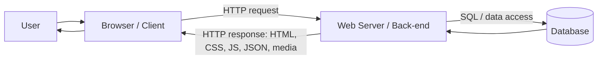
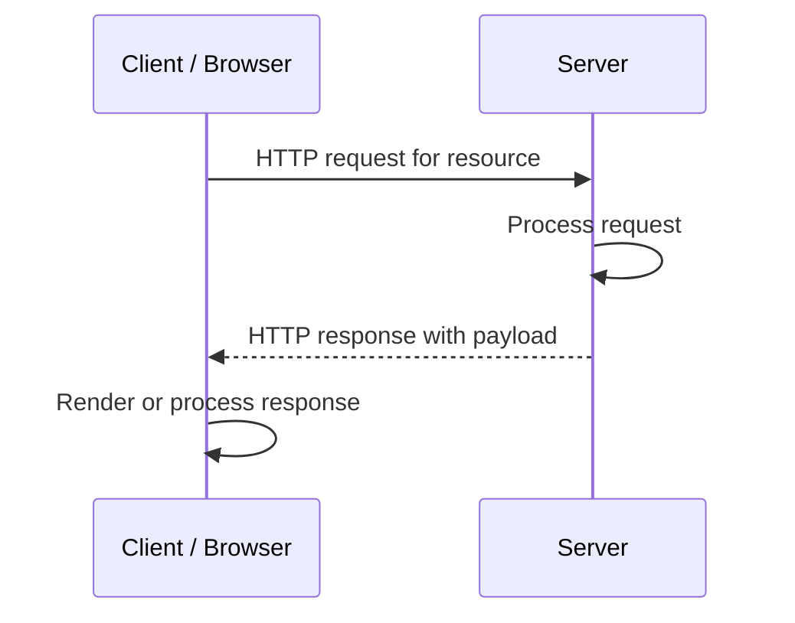
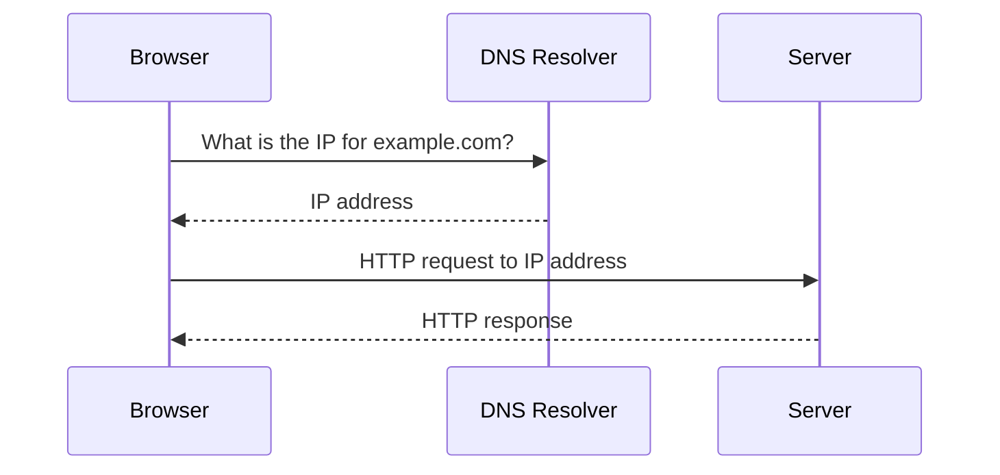
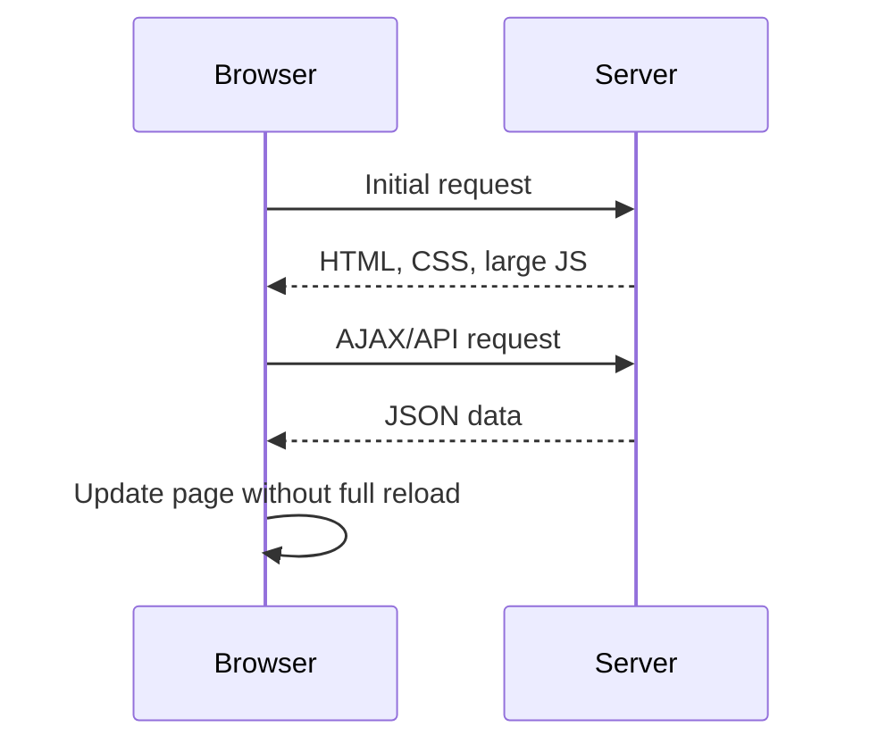

## Module Introduction - Web Architecture

> [!ABSTRACT]
> This lecture establishes the mental model for SCC.213: web applications are built from interacting client-side, server-side, and database components. The Web is only one service running over the wider Internet, usually using HTTP/HTTPS. A web application must be understood as a request/response system, but later lectures extend this model with AJAX, REST-style APIs, databases, and WebSockets.

## Internet vs Web


> [!DEFINITION]
> **Internet:** the broader global network infrastructure that supports many applications and protocols.
>
> **Web:** one means of information transfer over the Internet, typically using HTTP or HTTPS.

A common exam trap is treating the Internet and the Web as the same thing. In SCC.213, the Web is presented as an application-layer service that uses protocols such as HTTP to transfer web resources. Other Internet applications use other protocols.

## Web Application Architecture


> [!DEFINITION]
> **Web application architecture** is the framework defining interactions between the user interface, server logic, and databases. It affects performance, scalability, and security.

Core components:

- **Front-end / client-side:** handles user interface and user experience.
- **Back-end / server-side:** processes business logic, handles requests, and interacts with data storage.
- **Database:** stores and manages application data.



## Client-Server Model

> [!DEFINITION]
> **Client-server model:** a client requests data or services; the server processes the request and returns an appropriate response.

In the web context:

1. The browser acts as an HTTP client.
2. The server listens for incoming network connections.
3. The browser sends an HTTP request for a named resource.
4. The server processes the request.
5. The server returns an HTTP response containing a payload, such as HTML or another MIME type.



## URLs and Web Objects

A web page consists of **objects**. An object can be an HTML file, JPEG image, video, audio file, CSS file, or JavaScript file. A web page normally has a base HTML file that references additional objects.

A URL identifies an object, for example:

```text
www.clevername.com/someDept/pic.gif
```

This can be understood as:

- `www.clevername.com` = host name
- `/someDept/pic.gif` = server-specific path

## DNS

> [!DEFINITION]
> **DNS (Domain Name System)** is a distributed database used to map domain names to IP addresses.

Before a browser can request a page, it needs the server's IP address. The operating system and routers use IP addresses to route packets hop by hop through the network. DNS is used when the IP address for a domain name is not already known.



## Types of Web Application Architecture

### Multi-Page Applications (MPA)

> [!DEFINITION]
> **MPA:** a web application where different pages are loaded separately from the server.

In an MPA, navigating to a new page usually sends a new request and causes a full page reload.

Advantages:

- Better for SEO in many traditional cases.
- Easier to maintain for some kinds of applications.

Disadvantages:

- More server load.
- Slower navigation because each page change involves a new page load.

### Single Page Applications (SPA)

> [!DEFINITION]
> **SPA:** a web application where the front-end is loaded initially and later interactions update content without full page reloads.

In an SPA, the browser loads HTML, CSS, and often a large JavaScript bundle. Later updates usually happen through API calls, often using AJAX and JSON. This links to [[Server-Side JavaScript - Node.js, AJAX, Axios and Express#AJAX|AJAX]].

Advantages:

- Faster-feeling user experience after initial load.
- Reduced server work for repeated page rendering.

Disadvantages:

- SEO challenges.
- Initial load can be high.



### Monolithic Architecture

A monolithic architecture is a single indivisible unit where components are tightly coupled. It is simpler to develop and debug for small applications, but it can become harder to scale, update, and maintain.

### Microservices Architecture

Microservices split an application into small independent services that communicate through APIs. This supports scalability and technology flexibility but introduces complexity in deployment and management.

## Front-End Technologies

- **HTML:** structures page content.
- **CSS:** styles and visually formats the content.
- **JavaScript:** adds interactivity and dynamic behaviour.
- **Frameworks/libraries:** React, Angular, and Vue help manage complex UI state.

For HTML/CSS details, see [[Web Standards]]. For React, see [[JavaScript Promises, DOM Interactivity and React Basics#React]].

## Back-End Technologies

- **Server-side languages:** Node.js, Python, Ruby, Java.
- **Web servers:** Apache, Nginx, Node.js-based servers.
- **APIs:** RESTful services allow communication between front-end and back-end.

Runtime:: Node.js

## RESTful API Architecture

> [!DEFINITION]
> **RESTful API architecture:** an architectural style for designing networked applications using stateless, resource-based interactions and HTTP methods such as GET, POST, PUT, and DELETE.

A REST-style URL might identify a resource like:

```text
http://localhost:8080/customer/{id}
```

The important SCC.213 point is that the front-end and back-end communicate through resource-oriented requests, typically using HTTP methods.

## Databases and CRUD

Database_Concept:: CRUD

CRUD means:

- **Create** new data.
- **Read** existing data.
- **Update** existing data.
- **Delete** data.

SQL databases store structured relational data. NoSQL databases store data in more flexible non-relational forms. SCC.213 later focuses on SQL/SQLite in [[Server-Side JavaScript - Files, Express Static Serving and SQLite#SQLite]].

## Deployment Choices

> [!DEFINITION]
> **Deployment:** making an application available for use on a server.

Deployment environments:

- **Development:** local machines where developers write and test code.
- **Staging:** production-like testing environment.
- **Production:** live environment accessible to users.

Deployment models:

- **On-premises:** hosted on physical servers owned by the organisation.
- **Cloud-based:** hosted using cloud services, supporting scalability and lower operational overhead.
- **Hybrid:** combination of on-premises and cloud resources.

## Cloud Service Layers

The lecture uses the usual split between what the user manages and what the provider manages:

- **On-premises:** organisation manages applications, data, runtime, middleware, OS, virtualisation, servers, storage, networking.
- **IaaS:** provider manages lower infrastructure such as networking, storage, servers, virtualisation.
- **PaaS:** provider also manages OS, middleware, runtime.
- **SaaS:** provider manages nearly everything; user mainly consumes the application.

## Performance Metrics

Performance-related definitions from the lecture:

> [!DEFINITION]
> **Response time:** time taken for the server to process a request and send back a response.
>
> **Latency:** delay between the client's request and the server's initial response.
>
> **Throughput:** number of requests successfully handled by the server in a given timeframe.

Other metrics include error rate, resource utilisation, availability, and security.

> [!WARNING]
> Do not base performance conclusions on one run or one local measurement. The lecture emphasises sampling error, location effects, variability, standard deviation/error, confidence intervals, and histograms.

When distributions have a long right tail, the **median** may better characterise performance than the mean.

## Scalability and Performance

> [!DEFINITION]
> **Scalability:** the ability of an application to handle increasing load while maintaining performance goals.

- **Vertical scaling:** increasing the power of existing machines.
- **Horizontal scaling:** adding more machines to handle load.
- **Performance optimisation:** includes caching and load balancing.

## Caching and CDNs

Caching exploits locality by moving content closer to the user. This reduces hops, latency, transport cost, and network congestion.

Caching can happen:

- in the browser, controlled by HTTP headers;
- in the network;
- at the server;
- through CDNs.

> [!DEFINITION]
> **CDN (Content Delivery Network):** a system that caches content on servers closer to users.

## Exam Focus

- Distinguish the Internet from the Web.
- Explain the client-server request/response model.
- Describe front-end, back-end, and database roles.
- Explain URLs, hostnames, paths, and DNS lookup.
- Compare MPA and SPA behaviour.
- Explain REST-style use of HTTP methods and resources.
- Define response time, latency, throughput, scalability, vertical scaling, horizontal scaling, and caching.
- Explain why performance measurements need repeated runs and variability statistics.

## Common Mistakes

> [!WARNING]
> - Confusing the Internet with the Web.
> - Saying DNS transfers web pages; DNS maps domain names to IP addresses.
> - Treating the client-server model as a single machine model; in deployment these are usually separate machines or services.
> - Confusing latency with response time.
> - Assuming one local performance measurement is representative.
> - Saying SPA means “no server”; SPAs still usually call back-end APIs.
